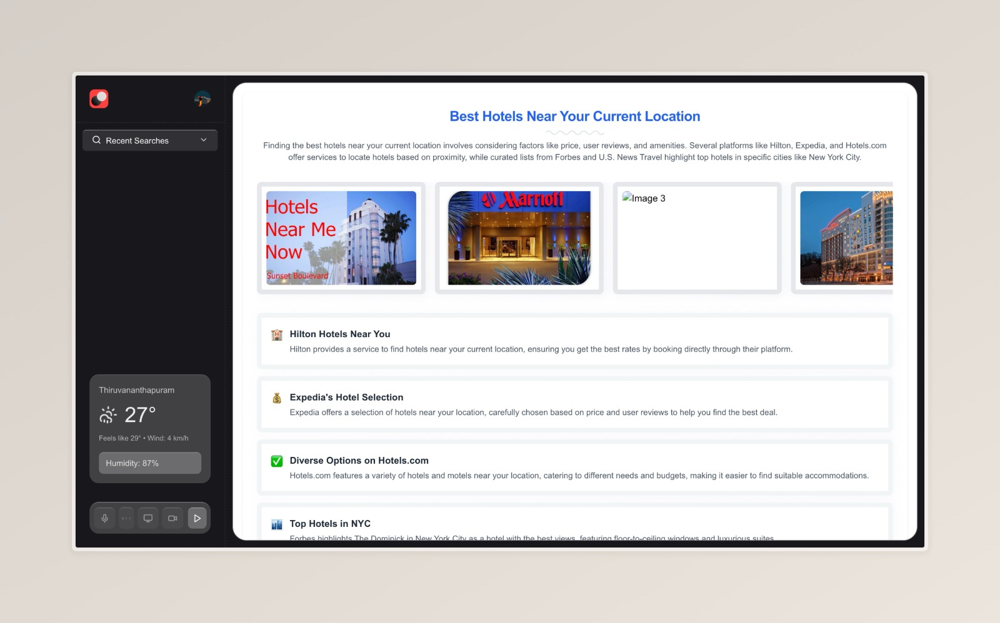

# Samantha

<p align="center">
  
</p>

<p align="center">
  
</p>

Samantha is an intelligent personal assistant inspired by the AI character from the movie "Her". Currently in early development, Samantha aims to provide a natural, intuitive, and helpful AI companion experience.

## 🌟 Overview

Samantha is designed to be more than just a tool - she's an assistant that learns your preferences, helps organize your digital life, and provides meaningful interactions. This project is in its early stages, with plans to expand functionality significantly in the coming months.


## 🛠️ Tech Stack

- **Frontend**: Next.js 15
- **Database**: Prisma ORM with SQLite 
- **Styling**: TailwindCSS
- **Authentication**: Clerk


## 📋 Prerequisites

- Node.js 18+ or Bun
- Git
- npm, yarn, or bun

## 🔧 Installation

1. Clone the repository:
   ```bash
   git clone https://github.com/yourusername/samantha.git
   cd samantha
   ```

2. Install dependencies:
   ```bash
   npm install
   # or
   yarn install
   # or
   bun install
   ```

3. Set up environment variables:
   Create a `.env.local` file in the root directory with the following variables:
   ```
   # Database
   DATABASE_URL="file:./dev.db"
   
   # Clerk Authentication
   NEXT_PUBLIC_CLERK_PUBLISHABLE_KEY=your_clerk_publishable_key
   CLERK_SECRET_KEY=your_clerk_secret_key
   
   # AI Providers (use the ones you need)
   OPENAI_API_KEY=your_openai_api_key
   GOOGLE_AI_API_KEY=your_google_ai_api_key
   GROQ_API_KEY=your_groq_api_key
   ```

4. Initialize the database:
   ```bash
   npx prisma migrate dev
   ```

5. Start the development server:
   ```bash
   npm run dev
   # or
   yarn dev
   # or
   bun dev
   ```

6. Open [http://localhost:3000](http://localhost:3000) in your browser to see Samantha in action.

## 🏗️ Project Structure

- **/app**: Main application code
  - **/api**: Backend API endpoints
  - **/(auth)**: Authentication pages and logic
  - **/(dashboard)**: Main application interface
- **/prisma**: Database schema and migrations
- **/components**: Reusable UI components
- **/lib**: Utility functions and shared logic
- **/contexts**: React context providers
- **/hooks**: Custom React hooks

## 🔐 Authentication

Samantha uses Clerk for authentication, providing:
- Email/password login
- Social login options
- User profile management
- Secure session handling

## 🖥️ Dashboard

The dashboard is the main interface for interacting with Samantha, featuring:
- Conversation history
- File management
- Search functionality
- User preference settings

## 🧰 Tools and APIs

Samantha is powered by a collection of specialized tools that enable her to perform various tasks. Each tool is designed for a specific purpose and follows a consistent structure for integration.

### Core Tools

| Tool Name | Purpose | Description |
|-----------|---------|-------------|
| `web_search` | Information retrieval | Searches the web for real-time information on any topic |
| `knowledge_base_query` | Personal data retrieval | Searches through your saved information and history |
| `create_folder` | Organization | Creates a new folder in your personal knowledge base |
| `create_file` | Content storage | Saves content (text, URLs, etc.) to your knowledge base |

### Tool Structure

Each tool in Samantha follows a consistent structure:

```typescript
interface Tool {
  name: string;           // Unique identifier for the tool
  description: string;    // What the tool does
  parameters: {           // Input parameters the tool accepts
    type: "object";
    properties: {
      [key: string]: {
        type: string;     // Data type (string, number, boolean, etc.)
        description: string;
        required?: boolean;
      }
    }
  };
}
```

### Example Tool Implementation

Here's an example of how the `web_search` tool is implemented:

```typescript
const webSearchTool: Tool = {
  name: "web_search",
  description: "Search the web for real-time information about any topic",
  parameters: {
    type: "object",
    properties: {
      query: {
        type: "string",
        description: "The search term to look up on the web",
        required: true
      }
    }
  }
};
```

### Using Tools in Conversations

Samantha intelligently selects and uses these tools based on user requests. For example:

1. User asks: "What's the weather in New York today?"
2. Samantha identifies this requires real-time information
3. She automatically invokes the `web_search` tool with appropriate parameters
4. The tool fetches current weather data
5. Samantha presents the information in a conversational format


## 🧩 Chrome Extension

A Chrome extension that integrates Samantha into your browsing experience is currently under development and will be added to this repository as a part of a monorepo structure soon. The extension will allow Samantha to:
- Understand context from your browsing
- Provide relevant assistance based on web content
- Save and organize information from the web

## 🗺️ Roadmap

- [ ] Improved conversation capabilities and tool calling 
- [ ] Advanced file management
- [ ] Chrome extension integration

## 🤝 Contributing

Contributions are welcome! Please feel free to submit a Pull Request.

1. Fork the repository
2. Create your feature branch (`git checkout -b feature/amazing-feature`)
3. Commit your changes (`git commit -m 'Add some amazing feature'`)
4. Push to the branch (`git push origin feature/amazing-feature`)
5. Open a Pull Request

## 📄 License

This project is licensed under the Apache License 2.0 - see the LICENSE file for details.

## Acknowledgements

- Inspired by the AI character Samantha from the movie "Her"
- Built with Next.js, React, and Tailwind CSS
- Powered by various AI providers including:
  - Vercel AI SDK
  - Gemini Realtime API
  - Audio encoder and decoder libraries
- All open source libraries used in this project are acknowledged, many of which are under the Apache License

---

<p align="center">
  <strong>Samantha</strong>
</p>

*Note: Samantha is currently in early development. Features and functionality are subject to change.*
